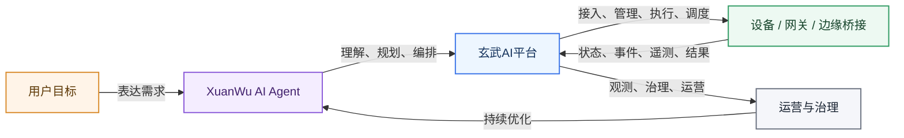
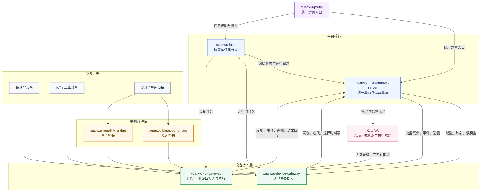

# 玄武AI智能设备平台

面向 `XuanWu AI Agent` 的统一智能设备平台

让智能代理不只是“理解意图”，还能够连接设备、协同网关、调度任务、持续运营。

[English](./README_en.md) | [Deutsch](./README_de.md) | [Português (Brasil)](./README_pt_BR.md) | [Tiếng Việt](./README_vi.md)

---

## 平台定位

`玄武AI智能设备平台` 是玄武设备生态中的本地平台层。

它要解决的，不仅仅是“设备怎么连上来”这一件事，而是：

> 当设备已经接入之后，怎样让 `XuanWu AI Agent` 持续、稳定、规模化地产生价值。

在真实场景里，用户表达的是目标，而不是单条设备命令；系统面对的是多设备、多通道、多网关、多协议的复杂环境。这个仓库的职责，就是把这些复杂性收敛成统一边界，让 Agent 可以围绕“理解、决策、执行、运营”形成闭环。

## 项目是什么

这个项目真正想做的，不是再造一个设备后台，而是为 `XuanWu AI Agent` 提供一套可以落到真实设备世界中的平台基础。

`XuanWu AI Agent` 最大的价值，不在于回答一句话，而在于把用户的目标转化成真实可执行的系统动作：

- 理解用户到底想完成什么，而不是只识别一条命令
- 协调多个设备、多个通道、多个网关去完成同一个目标
- 结合 Knowledge、Workflow、Model 和规则做持续决策
- 让设备从“被动响应”变成“可编排、可协同、可运营”的平台能力

而本仓库的角色，就是把这种智能代理能力落到设备平台层。它负责把设备接入、设备管理、网关执行、调度编排、统一门户、运营读模型与可观测性，收敛成清晰、稳定、可扩展的本地平台。

## 这个项目解决什么问题

### 让 Agent 面向目标，而不是面向单设备命令

用户说的是“帮我处理这件事”，平台要把它落成一系列可执行的设备动作，而不是停留在一条孤立的控制指令上。

### 让多设备协作成为平台能力，而不是业务拼装

多设备、多通道、多网关可以在统一边界下被编排、路由和执行，不需要每个业务场景都重新拼一遍。

### 让设备从“可连接”走向“可管理、可观测、可运营”

设备不再只是协议里的临时标识，而是平台中的正式对象，可以被发现、纳管、绑定、追踪、治理和运营。

### 让 Agent 域与设备平台域保持清晰边界

`XuanWu` 负责 Agent / Workflow / Knowledge / Model；本仓库负责设备、网关、调度、运营与观测。边界清楚，系统才能持续演进。

## 核心能力

### 1. 统一设备接入

平台统一承接多类设备，而不是把不同设备形态拆散到多个烟囱系统中：

- 会话型设备
- 执行型设备
- 传感器设备
- IoT / 工业设备
- 蓝牙与星闪等无线边缘设备

### 2. 统一设备管理

平台把设备管理相关能力沉淀到统一管理面中，包括：

- 设备归属与发现
- 生命周期与绑定
- 通道映射与能力路由
- 正式设备与发现设备管理
- 遥测、事件、告警与 OTA

### 3. 中心化 Agent 协同

`XuanWu` 承接 Agent 域真源与执行决策；本仓库提供本地设备平台底座。这种分层让智能体能力与设备平台能力协同工作，而不是互相耦合、互相污染边界。

### 4. 多协议、多网关扩展

平台通过 `xuanwu-device-gateway`、`xuanwu-iot-gateway`、`xuanwu-bluetooth-bridge`、`xuanwu-nearlink-bridge` 等模块对接不同协议与设备形态。新增设备类型时，无需重做整个平台，只需在统一边界内扩展接入能力。

### 5. 平台化运营

平台提供统一门户、统一视图、统一任务调度和统一读模型，支持从“接入设备”进一步走向“运营设备、治理设备、持续优化”。

## 端到端闭环

## 总体架构

从上到下分别对应统一入口、平台核心、设备接入层、无线桥接层与设备世界；`XuanWu` 作为智能体域，与平台管理面协同，并通过 IoT 网关面向设备世界执行能力。

## 服务组成

| 服务 | 角色 | 关键职责 |
| --- | --- | --- |
| `xuanwu-management-server` | 平台真源与运营真源 | 用户、通道、正式设备、发现设备、映射关系、遥测、事件、告警、OTA、调度记录、门户读模型 |
| `xuanwu-device-gateway` | 会话型设备接入层 | 运行时连接、会话管理、设备心跳与发现、OTA 接入、任务执行入口，关键路径包括 `/xuanwu/v1/` 与 `/xuanwu/ota/` |
| `xuanwu-iot-gateway` | IoT / 工业设备接入与执行层 | 协议适配、设备命令执行、上报归一化、网关侧 discovery / heartbeat、工业与无线桥接设备统一接入 |
| `xuanwu-jobs` | 任务调度与分发 | 到期任务轮询、claim / dispatch、cron 推进、retry、queued run |
| `xuanwu-portal` | 统一运营工作台 | Overview、Devices、Agents、Jobs、Alerts、用户与角色、通道与网关、AI Config Proxy、遥测与告警、设置 |
| `xuanwu-bluetooth-bridge` | 蓝牙桥接服务 | 无线设备连接、系统级打包、向 `xuanwu-iot-gateway` 回调集成 |
| `xuanwu-nearlink-bridge` | 星闪桥接服务 | 星闪设备桥接、系统环境解耦、向 `xuanwu-iot-gateway` 回调集成 |
| `XuanWu` | Agent 域真源与决策层 | Agent、Workflow、Knowledge、Model、上游管理与执行决策 |

## 平台支持的设备与协议

### 支持的设备类型

| 设备类型 | 接入入口 | 说明 |
| --- | --- | --- |
| 会话型设备 | `xuanwu-device-gateway` | 面向语音终端、会话型主设备、运行时在线设备 |
| 执行型设备 | `xuanwu-iot-gateway` | 面向开关、灯控、控制器、执行器等可下发动作设备 |
| 传感器设备 | `xuanwu-iot-gateway` | 面向状态采集、遥测上报、事件上报类设备 |
| IoT 设备 | `xuanwu-iot-gateway` | 面向常见联网外设与家庭/商业 IoT 设备 |
| 工业设备 | `xuanwu-iot-gateway` | 面向 PLC、楼控、工业总线与工业协议场景 |
| 蓝牙设备 | `xuanwu-bluetooth-bridge` -> `xuanwu-iot-gateway` | 面向 BLE 外设与近场无线设备 |
| 星闪设备 | `xuanwu-nearlink-bridge` -> `xuanwu-iot-gateway` | 面向 NearLink / 星闪设备与桥接场景 |

### 支持的协议与接入方式

| 协议 / 方式 | 入口模块 | 典型用途 |
| --- | --- | --- |
| WebSocket `/xuanwu/v1/` | `xuanwu-device-gateway` | 会话型设备主连接入口 |
| OTA `/xuanwu/ota/` | `xuanwu-device-gateway` | 设备配置发现与 OTA 接入 |
| HTTP | `xuanwu-iot-gateway` | 执行器控制、外部 API 型设备接入 |
| MQTT | `xuanwu-iot-gateway` | 设备命令、消息上报、Broker 接入 |
| Home Assistant | `xuanwu-iot-gateway` | HA service call、状态读取与集成 |
| HTTP Push | `xuanwu-iot-gateway` | 传感器主动上报与 ingest |
| Modbus TCP | `xuanwu-iot-gateway` | 工业寄存器、线圈、输入读写 |
| OPC UA | `xuanwu-iot-gateway` | 工业节点读写与 browse |
| BACnet/IP | `xuanwu-iot-gateway` | 楼宇控制与属性读取 |
| CAN Bridge | `xuanwu-iot-gateway` | CAN 桥接设备与帧查询/发送 |
| Bluetooth Bridge | `xuanwu-bluetooth-bridge` | 蓝牙连接、桥接与回调集成 |
| NearLink Bridge | `xuanwu-nearlink-bridge` | 星闪连接、桥接与回调集成 |

## 支持的能力范围

### 会话型设备平台

- 会话型设备接入
- 运行时会话管理
- OTA 与运行时配置下发
- 语音与多模态终端支持
- 会话设备纳管

### IoT 与工业设备平台

- 执行器控制
- 传感器上报
- 工业协议接入
- 无线边缘设备桥接
- 网关统一执行

### 统一管理平台

- 用户
- 通道
- 正式设备
- 发现设备
- 生命周期与绑定
- Agent / Model / Knowledge / Workflow 映射
- 遥测、事件、告警、OTA
- Jobs、Schedules 与运营读模型

### 统一运营入口

- 单一门户入口
- Overview Dashboard
- Devices / Agents / Jobs / Alerts 主工作区
- 用户、通道、网关、AI 配置代理、遥测与告警等运营页面

## 项目边界

为了避免职责混淆，这个仓库关注的是本地平台层：

- 设备接入
- 网关能力承接
- 统一设备管理
- 任务调度与分发
- 门户与运营视图
- 遥测、事件、告警、OTA
- 蓝牙 / 星闪等桥接集成

`XuanWu` 关注的是 Agent 域真源与执行决策：

- Agent
- Workflow
- Knowledge
- Model
- 上游管理 API
- 上游执行 API
- 面向设备世界的智能编排与决策

## 文档导航

建议按以下顺序阅读：

- [平台交付总览](./docs/platform-delivery-overview.md)
- [当前平台能力说明](./docs/current-platform-capabilities.md)
- [当前 API 总览](./docs/current-api-surfaces.md)
- [设备接入与纳管指南](./docs/device-ingress-and-management-guide.md)
- [当前项目状态](./docs/project/state/current.md)
- [Spec 索引](./docs/superpowers/specs/README.md)

核心设计参考：

- [平台蓝图](./docs/superpowers/specs/2026-03-30-xuanwu-platform-blueprint.md)
- [设备管理、设备网关与 IoT 网关集成设计](./docs/superpowers/specs/2026-04-01-device-management-gateway-device-server-integration-spec.md)
- [XuanWu 上游统一需求](./docs/superpowers/specs/2026-03-31-xuanwu-upstream-unified-requirements-spec.md)

## 后续方向

接下来的重点会集中在以下几个方向：

- 补齐 `XuanWu` 上游集成闭环
- 稳定平台管理与执行 API 边界
- 持续扩展设备协议与无线桥接能力
- 强化统一运营、观测与治理能力
- 进一步提升 Agent 与设备平台的协同效率

## 一句话总结

玄武 AI 智能设备平台，不仅仅能把各种设备统一管理进来，而且要成为让 `XuanWu AI Agent` 稳定驱动设备世界、持续产生业务价值的本地平台底座。
