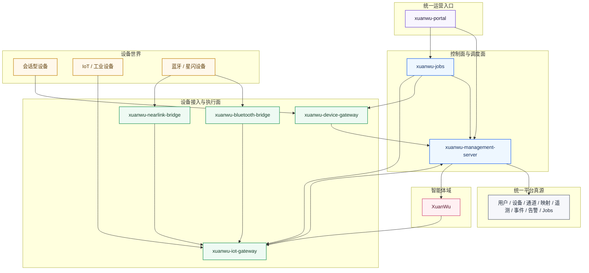
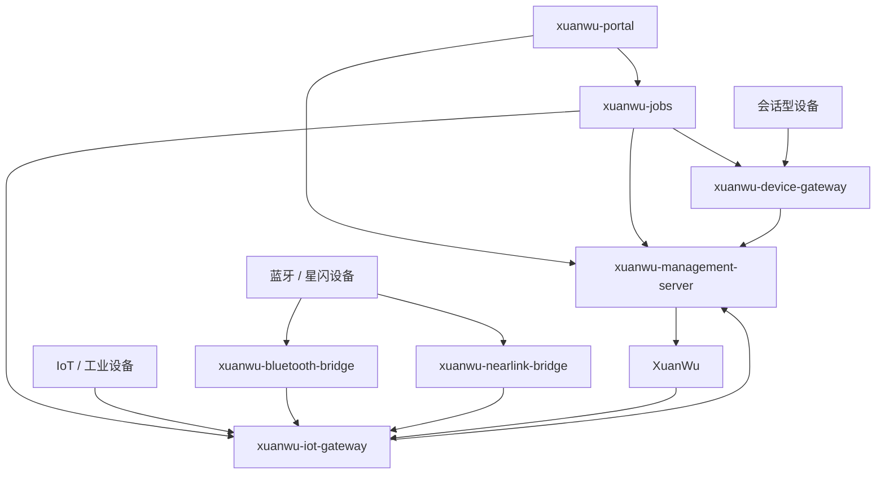

# 玄武AI智能设备平台

[English](./README_en.md) | [Deutsch](./README_de.md) | [Português (Brasil)](./README_pt_BR.md) | [Tiếng Việt](./README_vi.md)

玄武AI智能设备平台，是一套面向智能终端、IoT 设备、工业设备与无线边缘设备的统一平台底座。它不是某一个设备后端的简单集合，而是围绕“设备接入、设备管理、设备执行、任务调度、统一运营入口、智能体协同”建立起来的平台体系。这个仓库承接的是本地平台层，目标是把复杂的设备世界收敛成清晰、统一、可扩展的服务边界。

## 平台愿景图

## 项目是什么

这个项目是玄武设备生态中的本地平台层。它负责把不同类型的设备、不同协议的接入能力、统一设备管理、统一运营入口以及调度编排能力，收敛到一套一致的架构里。你可以把它理解成一套设备平台基础设施：

- 用 `xuanwu-device-gateway` 承接会话型设备与运行时终端
- 用 `xuanwu-iot-gateway` 承接 IoT、工业与无线桥接设备
- 用 `xuanwu-management-server` 维护统一设备真源与运营真源
- 用 `xuanwu-jobs` 负责平台任务调度与分发
- 用 `xuanwu-portal` 提供单一运营入口
- 用 `XuanWu` 承接 Agent 域真源与执行决策

这意味着，本仓库真正提供的不是某一条单点能力，而是一整套面向平台化的设备底座。

## 核心价值

### 统一设备接入

平台统一承接多类设备，而不是把不同设备类型分散到各自独立的小系统里：

- 会话型设备
- 执行型设备
- 传感器设备
- 工业设备
- 蓝牙与星闪等无线边缘设备

### 统一设备管理

平台把设备归属、发现、纳管、生命周期、通道映射、能力路由等能力放进统一管理面，而不是散落在不同接入服务里。设备不是协议里的临时标识，而是平台中的正式对象。

### 中心化智能体协同

`XuanWu` 负责 Agent、Workflow、Knowledge、Model 等智能体域能力；本仓库负责设备、网关、调度、可观测性和运营管理。这样的分层，让中心化 Agent 能力和本地设备平台能力协同起来，而不是互相污染边界。

### 多协议与多网关扩展

平台通过 `xuanwu-device-gateway`、`xuanwu-iot-gateway`、蓝牙桥接、星闪桥接等模块，向不同协议和不同设备形态扩展。新的设备类型不需要重做整个平台，只需要在统一边界内补齐接入能力。

### 平台化运营能力

平台提供统一前端入口、统一设备视图、统一遥测与事件、统一告警、统一任务调度与统一运营读模型，使系统能够从“可接设备”进一步走向“可运营、可治理、可扩展”。

## 目标能力

本项目的目标不是只覆盖某一种硬件，而是形成完整的智能设备与 IoT 平台能力。

### 会话型设备平台

- 会话型设备接入
- 运行时会话管理
- OTA 与运行时配置下发
- 语音与多模态终端支持
- 会话设备纳管

### IoT 与工业设备平台

- 执行器控制
- 传感器上报
- 工业协议接入
- 无线边缘设备桥接
- 网关统一执行

### 统一管理平台

- 用户
- 通道
- 正式设备
- 发现设备
- 生命周期与绑定
- Agent / Model / Knowledge / Workflow 映射
- 遥测、事件、告警、OTA
- Jobs、Schedules 与运营读模型

### 统一运营入口

- 单一门户入口
- Overview Dashboard
- Devices / Agents / Jobs / Alerts 主工作区
- 用户、通道、网关、AI 配置代理、遥测与告警等运营页面

## 总体架构

## 服务边界

### `xuanwu-management-server`

统一真源，负责平台里的核心业务事实与运营读模型，包括：

- 用户
- 通道
- 正式设备
- 发现设备
- 映射关系
- 遥测、事件、告警
- OTA
- 调度与运行记录
- 门户读模型

### `xuanwu-device-gateway`

会话型设备接入层，负责承接智能终端的运行时连接与会话入口，包括：

- 会话型设备连接
- 会话型主连接入口 `/xuanwu/v1/`
- 运行时会话处理
- OTA 接入，关键入口为 `/xuanwu/ota/`
- 运行时 discovery 与 heartbeat
- 运行时任务执行入口

### `xuanwu-iot-gateway`

IoT / 工业设备接入与执行层，负责把复杂协议、现场设备和统一平台能力之间的边界收敛起来，包括：

- 协议适配
- 设备命令执行
- 上报归一化
- 网关侧 discovery 与 heartbeat
- 工业、传感器、执行器、无线桥接设备统一接入

### `xuanwu-jobs`

轻量调度与分发服务，负责把平台里的周期任务、延迟任务和运行记录串起来，包括：

- 到期任务轮询
- claim 与 dispatch
- cron 推进
- retry 与 queued run 流程

### `xuanwu-portal`

统一前端入口，负责把平台里的关键运营能力收敛成一个统一的工作台，包括：

- Overview
- Devices
- Agents
- Jobs
- Alerts
- 用户与角色
- 通道与网关
- AI Config Proxy
- 遥测与告警
- 设置

### `xuanwu-bluetooth-bridge` 与 `xuanwu-nearlink-bridge`

独立桥接服务，负责无线设备连接、系统级打包以及向 `xuanwu-iot-gateway` 的回调集成。它们的意义，是把蓝牙与星闪这类更贴近现场和系统环境的能力，从主网关进程中解耦出来。

## 当前仓库状态

当前主线代码已经完成了本仓范围内绝大部分平台实现工作。换句话说，设备管理、设备接入、协议适配、调度、门户与桥接这几条主线，在本仓内部已经基本成形。现阶段主要剩余阻塞集中在 `XuanWu` 上游集成，包括：

- 稳定的上游管理 API
- 稳定的上游执行 API
- `XuanWu -> xuanwu-iot-gateway` 的设备调用链联调

这也意味着，本仓已经基本具备平台底座能力，剩余核心工作主要是与 `XuanWu` 完成最终协同闭环。

## 文档导航

建议优先阅读以下文档：

- [平台交付总览](./docs/platform-delivery-overview.md)
- [当前平台能力说明](./docs/current-platform-capabilities.md)
- [当前 API 总览](./docs/current-api-surfaces.md)
- [设备接入与纳管指南](./docs/device-ingress-and-management-guide.md)
- [当前项目状态](./docs/project/state/current.md)
- [Spec 索引](./docs/superpowers/specs/README.md)

核心设计参考：

- [平台蓝图](./docs/superpowers/specs/2026-03-30-xuanwu-platform-blueprint.md)
- [设备管理、设备网关与 IoT 网关集成设计](./docs/superpowers/specs/2026-04-01-device-management-gateway-device-server-integration-spec.md)
- [XuanWu 上游统一需求](./docs/superpowers/specs/2026-03-31-xuanwu-upstream-unified-requirements-spec.md)

## 方向

本项目后续的方向是：

- 用统一平台承接设备管理与运营
- 用统一网关体系承接设备能力调用
- 用统一门户承接运营视图
- 用 `XuanWu` 承接 Agent 域真源与执行决策

本仓库就是这套玄武AI智能设备平台架构的本地平台基础。
