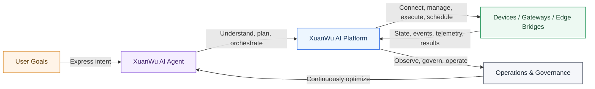
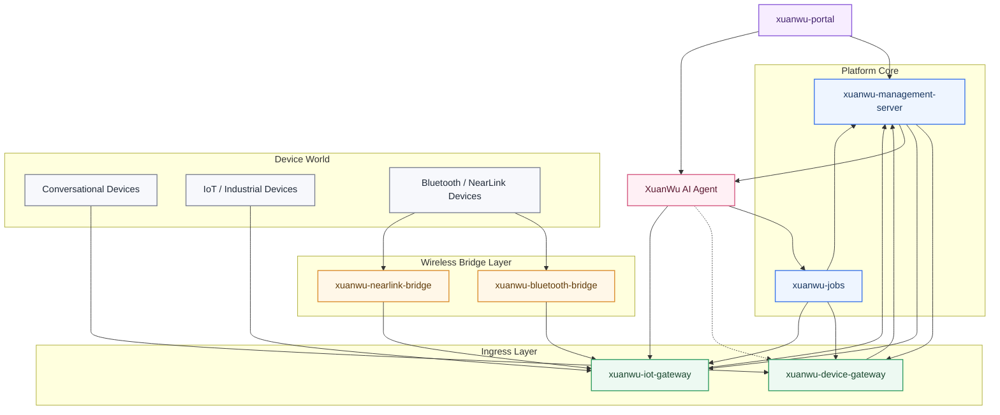

# XuanWu AI Device Platform

The unified intelligent device platform for `XuanWu AI Agent`

Make the intelligent agent do more than understand intent: connect devices, coordinate gateways, schedule jobs, and support continuous operations.

[简体中文](./README.md)

---

## Positioning

The `XuanWu AI Device Platform` is the local platform layer of the XuanWu device ecosystem.

Its purpose is not only to answer the question “how do devices connect?”, but a more important one:

> Once devices are connected, how can `XuanWu AI Agent` keep producing value in a stable and scalable way?

In real scenarios, users express goals, not individual device commands. The system faces a complex environment of multiple devices, multiple channels, multiple gateways, and multiple protocols. This repository exists to reduce that complexity into clear platform boundaries so the Agent can form a closed loop around understanding, decision-making, execution, and operations.

## What This Project Is

This project is not just another device backend. It is the platform foundation that allows `XuanWu AI Agent` to operate in the real device world.

The greatest value of `XuanWu AI Agent` is not simply answering a prompt. Its value is in turning user goals into real system actions:

- understanding what the user is actually trying to achieve, not just parsing a single command
- coordinating multiple devices, channels, and gateways toward one outcome
- making continuous decisions with Knowledge, Workflow, Models, and rules
- turning devices from passive endpoints into orchestrated, collaborative, and operable platform capabilities

This repository provides the platform layer that makes that possible. It brings together device ingress, device management, gateway execution, scheduling, a unified portal, operational read models, and observability into one coherent local platform.

## What Problems It Solves

### Let the Agent work toward outcomes, not isolated commands

Users ask to get something done. The platform translates that into a series of executable device actions instead of stopping at one disconnected control instruction.

### Make multi-device coordination a platform capability

Multiple devices, channels, and gateways can be orchestrated, routed, and executed within a unified platform boundary instead of being rebuilt in each business scenario.

### Move devices from “connectable” to “manageable, observable, operable”

Devices are no longer temporary identifiers hidden inside protocols. They become formal platform objects that can be discovered, onboarded, bound, tracked, governed, and operated.

### Keep a clear boundary between the Agent domain and the device platform domain

`XuanWu` owns Agent, Workflow, Knowledge, and Model concerns. This repository owns devices, gateways, scheduling, operations, and observability. Clear boundaries allow the system to evolve cleanly.

## Core Capabilities

### 1. Unified device ingress

The platform supports multiple device classes through one coherent platform model:

- conversational devices
- actuator devices
- sensor devices
- IoT / industrial devices
- wireless edge devices such as Bluetooth and NearLink

### 2. Unified device management

The platform centralizes device management capabilities including:

- device ownership and discovery
- lifecycle and binding
- channel mapping and capability routing
- managed devices and discovered devices
- telemetry, events, alarms, and OTA

### 3. Centralized Agent collaboration

`XuanWu` provides Agent-domain truth, user-facing intelligence, and execution decisions. This repository provides the local device platform. The two work together without collapsing their boundaries into one system.

### 4. Multi-protocol, multi-gateway extensibility

The platform expands through `xuanwu-device-gateway`, `xuanwu-iot-gateway`, `xuanwu-bluetooth-bridge`, and `xuanwu-nearlink-bridge`. New device types can be added by extending ingress and protocol boundaries instead of rebuilding the whole platform.

### 5. Platform-grade operations

The platform provides a unified portal, unified views, unified scheduling, and unified operational read models so the system can evolve from “connected devices” to “operated, governed, continuously improved devices”.

## End-to-End Loop

## Overall Architecture

From top to bottom, the layers represent the unified entrypoint, platform core, ingress gateways, wireless bridges, and the device world. `XuanWu AI Agent` sits above the platform, interacts directly with the portal, and collaborates with the management, scheduling, and gateway services to complete execution loops.

Notes:
- `xuanwu-portal` connects both to the platform core and directly to `XuanWu AI Agent`
- conversational devices always connect through `xuanwu-device-gateway`
- IoT, industrial, and wireless devices connect through `xuanwu-iot-gateway` and the bridge layer
- the dotted line from `XuanWu` to `xuanwu-device-gateway` represents runtime collaboration, not physical ingress

## Service Composition

| Service | Role | Key Responsibilities |
| --- | --- | --- |
| `xuanwu-management-server` | Platform truth and operational truth | users, channels, managed devices, discovered devices, mappings, telemetry, events, alarms, OTA, schedule records, portal read models |
| `xuanwu-device-gateway` | Conversational device ingress | runtime connection, session handling, heartbeat and discovery, OTA ingress, execution entrypoints, including `/xuanwu/v1/` and `/xuanwu/ota/` |
| `xuanwu-iot-gateway` | IoT / industrial ingress and execution | protocol adaptation, device command execution, ingest normalization, gateway-side discovery / heartbeat, industrial and wireless-bridge-backed device ingress |
| `xuanwu-jobs` | Job scheduling and dispatch | due schedule polling, claim / dispatch, cron progression, retry, queued runs |
| `xuanwu-portal` | Unified operations workspace | Overview, Devices, Agents, Jobs, Alerts, users and roles, channels and gateways, AI config proxy, telemetry and alarms, settings |
| `xuanwu-bluetooth-bridge` | Bluetooth bridge service | wireless device connection, system-level packaging, callback integration into `xuanwu-iot-gateway` |
| `xuanwu-nearlink-bridge` | NearLink bridge service | NearLink device bridging, system environment decoupling, callback integration into `xuanwu-iot-gateway` |
| `XuanWu` | Agent-domain truth and decision layer | Agent, Workflow, Knowledge, Model, user-facing intelligence, execution decisions, and collaboration with `xuanwu-portal`, `xuanwu-management-server`, `xuanwu-jobs`, `xuanwu-device-gateway`, and `xuanwu-iot-gateway` |

## Supported Device and Protocol Coverage

### Supported device classes

| Device Class | Ingress Entry | Description |
| --- | --- | --- |
| Conversational Devices | `xuanwu-device-gateway` | voice terminals, conversational primary devices, runtime-online devices |
| Actuator Devices | `xuanwu-iot-gateway` | switches, lighting, controllers, and command-driven devices |
| Sensor Devices | `xuanwu-iot-gateway` | telemetry, sensing, and event-reporting devices |
| IoT Devices | `xuanwu-iot-gateway` | common connected peripherals and smart IoT devices |
| Industrial Devices | `xuanwu-iot-gateway` | PLC, building control, industrial buses, and industrial protocol scenarios |
| Bluetooth Devices | `xuanwu-bluetooth-bridge` -> `xuanwu-iot-gateway` | BLE peripherals and near-field wireless devices |
| NearLink Devices | `xuanwu-nearlink-bridge` -> `xuanwu-iot-gateway` | NearLink devices and bridge-based wireless scenarios |

### Supported protocols and ingress styles

| Protocol / Mode | Entry Module | Typical Usage |
| --- | --- | --- |
| WebSocket `/xuanwu/v1/` | `xuanwu-device-gateway` | primary ingress for conversational devices |
| OTA `/xuanwu/ota/` | `xuanwu-device-gateway` | device config discovery and OTA |
| HTTP | `xuanwu-iot-gateway` | actuator control and external API style device access |
| MQTT | `xuanwu-iot-gateway` | device commands, message ingest, broker-based connectivity |
| Home Assistant | `xuanwu-iot-gateway` | HA service calls, state reading, and integration |
| HTTP Push | `xuanwu-iot-gateway` | active sensor ingest |
| Modbus TCP | `xuanwu-iot-gateway` | industrial register, coil, and input operations |
| OPC UA | `xuanwu-iot-gateway` | industrial node access and browse |
| BACnet/IP | `xuanwu-iot-gateway` | building automation and property access |
| CAN Bridge | `xuanwu-iot-gateway` | CAN bridge devices and frame operations |
| Bluetooth Bridge | `xuanwu-bluetooth-bridge` | Bluetooth connectivity and callback integration |
| NearLink Bridge | `xuanwu-nearlink-bridge` | NearLink connectivity and callback integration |

## Supported Capability Domains

### Conversational device platform

- conversational device ingress
- runtime session management
- OTA and runtime config delivery
- voice and multimodal terminal support
- conversational device onboarding

### IoT and industrial platform

- actuator control
- sensor ingest
- industrial protocol access
- wireless edge bridging
- gateway-based execution

### Unified management platform

- users
- channels
- managed devices
- discovered devices
- lifecycle and binding
- Agent / Model / Knowledge / Workflow mappings
- telemetry, events, alarms, OTA
- jobs, schedules, and operational read models

### Unified operations entrypoint

- single portal entrypoint
- Overview dashboard
- Devices / Agents / Jobs / Alerts workspaces
- users, channels, gateways, AI config proxy, telemetry, and alarm views

## Project Boundary

This repository focuses on the local platform layer:

- device ingress
- gateway capability hosting
- unified device management
- job scheduling and dispatch
- portal and operational views
- telemetry, events, alarms, OTA
- Bluetooth / NearLink bridge integration

`XuanWu` focuses on Agent-domain truth, user interaction, and execution decisions:

- Agent
- Workflow
- Knowledge
- Model
- user-facing intelligent interaction
- upstream management APIs
- upstream execution APIs
- intelligent orchestration and decision-making for the device world

## Documentation

Recommended reading order:

- [Platform Delivery Overview](./docs/platform-delivery-overview.md)
- [Current Platform Capabilities](./docs/current-platform-capabilities.md)
- [Current API Surfaces](./docs/current-api-surfaces.md)
- [Device Ingress and Management Guide](./docs/device-ingress-and-management-guide.md)
- [Current Project State](./docs/project/state/current.md)
- [Spec Index](./docs/superpowers/specs/README.md)

Core design references:

- [Platform Blueprint](./docs/superpowers/specs/2026-03-30-xuanwu-platform-blueprint.md)
- [Device Management, Device Gateway, and IoT Gateway Integration](./docs/superpowers/specs/2026-04-01-device-management-gateway-device-server-integration-spec.md)
- [Unified Upstream Requirements for XuanWu](./docs/superpowers/specs/2026-03-31-xuanwu-upstream-unified-requirements-spec.md)

## Direction

The next focus areas are:

- expanding protocol coverage and wireless bridge capabilities
- strengthening unified operations, observability, and governance
- improving collaboration efficiency between the Agent layer and the device platform

## One-Line Summary

The XuanWu AI Device Platform is not only a way to manage many types of devices in one place, but the local platform foundation that allows `XuanWu AI Agent` to reliably drive the device world and continuously create business value.
