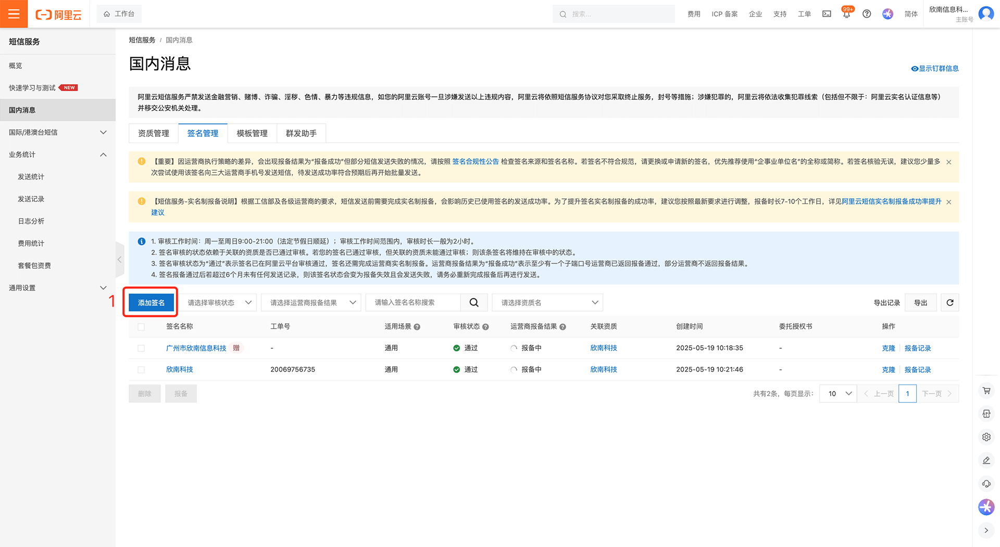
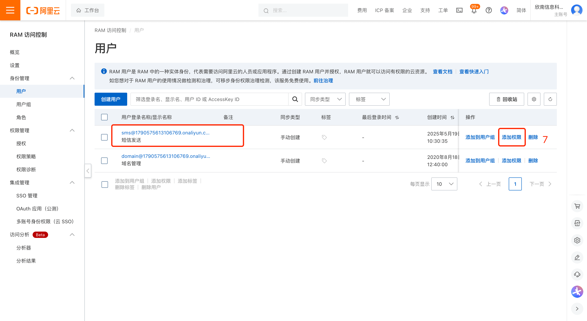

# 闃块噷浜戠煭淇￠泦鎴愭寚鍗?

鐧诲綍闃块噷浜戞帶鍒跺彴锛岃繘鍏モ€滅煭淇℃湇鍔♀€濋〉闈細https://dysms.console.aliyun.com/overview

## 绗竴姝?娣诲姞绛惧悕

浠ヤ笂姝ラ锛屼細寰楀埌绛惧悕锛岃鎶婂畠鍐欏叆鍒版櫤鎺у彴鍙傛暟锛宍aliyun.sms.sign_name`

## 绗簩姝?娣诲姞妯＄増

浠ヤ笂姝ラ锛屼細寰楀埌妯＄増code锛岃鎶婂畠鍐欏叆鍒版櫤鎺у彴鍙傛暟锛宍aliyun.sms.sms_code_template_code`

娉ㄦ剰锛岀鍚嶈绛?涓伐浣滄棩锛岀瓑杩愯惀鍟嗘姤澶囨垚鍔熷悗鎵嶈兘鍙戦€佹垚鍔熴€?

娉ㄦ剰锛岀鍚嶈绛?涓伐浣滄棩锛岀瓑杩愯惀鍟嗘姤澶囨垚鍔熷悗鎵嶈兘鍙戦€佹垚鍔熴€?

娉ㄦ剰锛岀鍚嶈绛?涓伐浣滄棩锛岀瓑杩愯惀鍟嗘姤澶囨垚鍔熷悗鎵嶈兘鍙戦€佹垚鍔熴€?

鍙互绛夋姤澶囨垚鍔熷悗锛屽啀缁х画寰€涓嬫搷浣溿€?

## 绗笁姝?鍒涘缓鐭俊璐︽埛鍜屽紑閫氭潈闄?

鐧诲綍闃块噷浜戞帶鍒跺彴锛岃繘鍏モ€滆闂帶鍒垛€濋〉闈細https://ram.console.aliyun.com/overview?activeTab=overview

浠ヤ笂姝ラ锛屼細寰楀埌access_key_id鍜宎ccess_key_secret锛岃鎶婂畠鍐欏叆鍒版櫤鎺у彴鍙傛暟锛宍aliyun.sms.access_key_id`銆乣aliyun.sms.access_key_secret`
## 绗洓姝?鍚姩鎵嬫満娉ㄥ唽鍔熻兘

1銆佹甯告潵璇达紝浠ヤ笂淇℃伅閮藉～瀹屽悗锛屼細鏈夎繖涓晥鏋滐紝濡傛灉娌℃湁锛屽彲鑳界己灏戜簡鏌愪釜姝ラ

2銆佸紑鍚厑璁搁潪绠＄悊鍛樼敤鎴峰彲娉ㄥ唽锛屽皢鍙傛暟`server.allow_user_register`璁剧疆鎴恅true`

3銆佸紑鍚墜鏈烘敞鍐屽姛鑳斤紝灏嗗弬鏁癭server.enable_mobile_register`璁剧疆鎴恅true`

