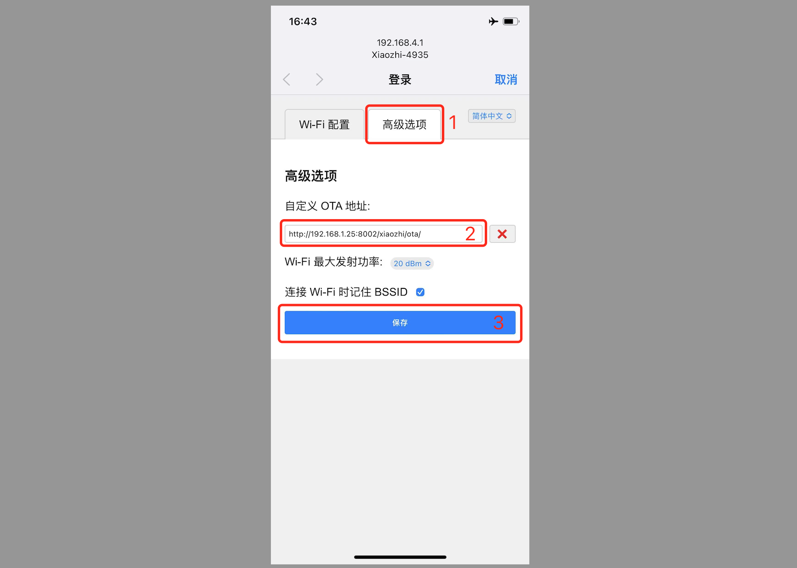

# 鍩轰簬铏惧摜缂栬瘧濂界殑鍥轰欢閰嶇疆鑷畾涔夋湇鍔″櫒

## 绗?姝?纭鐗堟湰
鐑у綍铏惧摜宸茬粡缂栬瘧濂界殑[1.6.1鐗堟湰浠ヤ笂鍥轰欢](https://github.com/78/xiaozhi-esp32/releases)

## 绗?姝?鍑嗗浣犵殑ota鍦板潃
濡傛灉浣犳寜鐓ф暀绋嬩娇鐢ㄧ殑鏄叏妯″潡閮ㄧ讲锛屽氨搴旇浼氭湁ota鍦板潃銆?

姝ゅ埢锛岃浣犵敤娴忚鍣ㄦ墦寮€浣犵殑ota鍦板潃锛屼緥濡傛垜鐨刼ta鍦板潃
```
https://2662r3426b.vicp.fun/xiaozhi/ota/
```

濡傛灉鏄剧ず鈥淥TA鎺ュ彛杩愯姝ｅ父锛寃ebsocket闆嗙兢鏁伴噺锛歑鈥濄€傞偅灏卞線涓嬨€?

濡傛灉鏄剧ず鈥淥TA鎺ュ彛杩愯涓嶆甯糕€濓紝澶ф鏄綘杩樻病鍦╜鏅烘帶鍙癭閰嶇疆`Websocket`鍦板潃銆傞偅灏憋細

- 1銆佷娇鐢ㄨ秴绾х鐞嗗憳鐧诲綍鏅烘帶鍙?

- 2銆侀《閮ㄨ彍鍗曠偣鍑籤鍙傛暟绠＄悊`

- 3銆佸湪鍒楄〃涓壘鍒癭server.websocket`椤圭洰锛岃緭鍏ヤ綘鐨刞Websocket`鍦板潃銆備緥濡傛垜鐨勫氨鏄?

```
wss://2662r3426b.vicp.fun/xiaozhi/v1/
```

閰嶇疆瀹屽悗锛屽啀浣跨敤娴忚鍣ㄥ埛鏂颁綘鐨刼ta鎺ュ彛鍦板潃锛岀湅鐪嬫槸涓嶆槸姝ｅ父浜嗐€傚鏋滆繕涓嶆甯稿氨锛屽氨鍐嶆纭涓€涓媁ebsocket鏄惁姝ｅ父鍚姩锛屾槸鍚﹂厤缃簡Websocket鍦板潃銆?

## 绗?姝?杩涘叆閰嶇綉妯″紡
杩涘叆鏈哄櫒鐨勯厤缃戞ā寮忥紝鍦ㄩ〉闈㈤《閮紝鐐瑰嚮鈥滈珮绾ч€夐」鈥濓紝鍦ㄩ噷闈㈣緭鍏ヤ綘鏈嶅姟鍣ㄧ殑`ota`鍦板潃锛岀偣鍑讳繚瀛樸€傞噸鍚澶?


## 绗?姝?鍞ら啋灏忔櫤锛屾煡鐪嬫棩蹇楄緭鍑?

鍞ら啋灏忔櫤锛岀湅鐪嬫棩蹇楁槸涓嶆槸姝ｅ父杈撳嚭銆?


## 甯歌闂
浠ヤ笅鏄竴浜涘父瑙侀棶棰橈紝渚涘弬鑰冿細

[1銆佷负浠€涔堟垜璇寸殑璇濓紝灏忔櫤璇嗗埆鍑烘潵寰堝闊╂枃銆佹棩鏂囥€佽嫳鏂嘳(./FAQ.md)

[2銆佷负浠€涔堜細鍑虹幇鈥淭TS 浠诲姟鍑洪敊 鏂囦欢涓嶅瓨鍦ㄢ€濓紵](./FAQ.md)

[3銆乀TS 缁忓父澶辫触锛岀粡甯歌秴鏃禲(./FAQ.md)

[4銆佷娇鐢╓ifi鑳借繛鎺ヨ嚜寤烘湇鍔″櫒锛屼絾鏄?G妯″紡鍗存帴涓嶄笂](./FAQ.md)

[5銆佸浣曟彁楂樺皬鏅哄璇濆搷搴旈€熷害锛焆(./FAQ.md)

[6銆佹垜璇磋瘽寰堟參锛屽仠椤挎椂灏忔櫤鑰佹槸鎶㈣瘽](./FAQ.md)

[7銆佹垜鎯抽€氳繃灏忔櫤鎺у埗鐢电伅銆佺┖璋冦€佽繙绋嬪紑鍏虫満绛夋搷浣淽(./FAQ.md)


