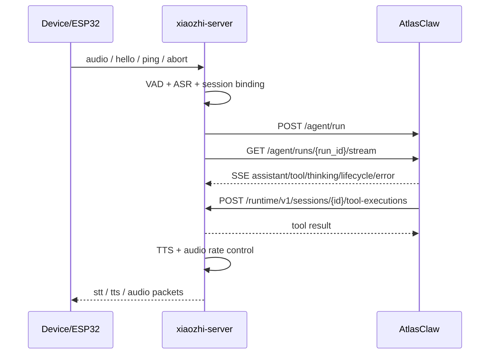

# AtlasClaw 主对话引擎专项设计文档

## 1. 文档目的

本文档定义 `xiaozhi-server` 与 `AtlasClaw` 的重构目标架构，并明确本次重构的核心决策：

- `AtlasClaw` 成为唯一主对话引擎
- `xiaozhi-server` 保留为设备接入与执行层
- 当前本地 `LLM`、`Intent`、`Memory` 不再承担主对话职责
- 设备本地能力通过运行时 API 暴露给 `AtlasClaw`，由 `AtlasClaw` 统一规划与调度

本文档是后续实现、接口联调、模块下线和测试验收的唯一设计依据。

## 2. 背景与问题

当前项目中，`xiaozhi-server` 同时承担了以下职责：

- 设备 WebSocket 接入
- 音频输入输出与流控
- ASR / TTS
- 本地意图识别
- 本地 LLM 回复生成
- 本地工具调度
- 记忆与上下文处理

这种设计的问题是：

- 设备接入逻辑与对话智能强耦合，`core/connection.py` 过重
- 本地 `Intent`、`LLM`、`Memory`、工具执行流程交织，扩展和替换成本高
- 很难复用 `AtlasClaw` 已具备的会话、Agent、Tool、Skill、Memory 能力
- 主对话链路无法升级为真正的智能代理模式

本次重构的目标不是将 `AtlasClaw` 作为普通 LLM 提供方接入，而是将其提升为整个系统的唯一主对话引擎。

## 3. 设计目标

### 3.1 核心目标

- 设备连接、音频采集、TTS 播放仍由 `xiaozhi-server` 负责
- 用户文本一旦形成，即由 `AtlasClaw` 负责主对话、任务规划、工具选择和记忆管理
- 所有复杂语义代理行为统一收敛到 `AtlasClaw`
- `xiaozhi-server` 只做运行时执行、协议转换和实时控制

### 3.2 非目标

- 本阶段不重写 Web 管理台或移动端
- 本阶段不将 `AtlasClaw` 内嵌到 `xiaozhi-server` 进程内
- 本阶段不保留“双主引擎”长期并行模式
- 本阶段不重新设计设备协议

## 4. 总体架构

### 4.1 重构后的职责边界

`xiaozhi-server` 负责：

- 设备协议接入
- WebSocket / HTTP / OTA / MQTT
- VAD / ASR / TTS / 音频流控
- 设备连接状态
- `hello` / `ping` / `abort` / `listen` / `server` 等设备控制消息
- 设备本地工具执行
- 为 `AtlasClaw` 提供运行时能力 API

`AtlasClaw` 负责：

- 主会话管理
- 主对话生成
- 意图识别与任务规划
- Tool / Skill / Provider 调度
- 记忆与上下文编排
- 多步代理推理
- 最终回复流生成

### 4.2 目标调用链



## 5. 当前代码现状与替换点

### 5.1 当前主对话链路

当前 `xiaozhi-server` 的主对话链路主要位于以下文件：

- `main/xiaozhi-server/core/handle/receiveAudioHandle.py`
- `main/xiaozhi-server/core/handle/intentHandler.py`
- `main/xiaozhi-server/core/connection.py`
- `main/xiaozhi-server/core/utils/modules_initialize.py`
- `main/xiaozhi-server/core/providers/tools/unified_tool_handler.py`

当前流程大致为：

1. 设备上传音频
2. 本地 `VAD` 判断说话状态
3. 本地 `ASR` 产出文本
4. `receiveAudioHandle.startToChat()` 启动对话
5. `intentHandler.handle_user_intent()` 决定是否命中意图与函数调用
6. 若未命中，则 `conn.chat()` 使用本地 `LLM` 生成回复
7. 本地工具由 `UnifiedToolHandler` 执行
8. 本地 `TTS` 转语音返回设备

### 5.2 本次重构后的主替换点

以下逻辑将从本地主路径中移出：

- 主回复生成
- 主意图识别
- 主记忆管理
- 主工具规划

以下逻辑保留在本地：

- 音频处理
- 设备状态控制
- 实时中断
- TTS 输出
- 设备本地能力执行

## 6. 关键设计决策

### 6.1 AtlasClaw 是唯一主对话引擎

默认情况下：

- 所有用户自然语言输入均发送到 `AtlasClaw`
- 本地 `Intent` 不参与主决策
- 本地 `LLM` 不生成主回复
- 本地 `Memory` 不维护主会话状态

本地组件仅保留两种用途：

- 设备级即时控制
- 紧急 fallback

### 6.2 `AtlasClaw` 不作为 LLM Provider 集成

本次不将 `AtlasClaw` 塞入 `core/providers/llm/*`。

原因：

- `AtlasClaw` 是 Agent 平台，不是单纯模型调用方
- 它有会话、工具、技能、上下文、SSE 事件流等更高层语义
- 把它封装成普通 LLM provider 会丢失工具事件、思考阶段、会话控制能力

因此应新增 `DialogueEngine` 抽象，并实现 `AtlasClawDialogueEngine`。

### 6.3 设备是会话主体

`AtlasClaw` 默认的 `/sessions` 设计偏向“认证用户作为会话主体”，这与设备型场景不完全一致。

因此本次设计采用：

- `xiaozhi-server` 自行构造稳定的 `session_key`
- 直接调用 `AtlasClaw /agent/run`
- 不依赖 `AtlasClaw /sessions` 接口来分配会话身份

## 7. 会话与身份模型

### 7.1 会话主体

本设计中会话主体是“设备连接”而不是浏览器用户。

定义如下：

- `device_id`：设备标识，主会话主体
- `client_id`：单设备下的连接实例标识
- `runtime_session_id`：`xiaozhi-server` 本地会话 ID
- `atlas_session_key`：发给 `AtlasClaw` 的稳定会话键

### 7.2 `atlas_session_key` 规范

推荐规范如下：

- 单设备单会话：
  - `agent:main:user:device-{device_id}:xiaozhi:dm:{device_id}`
- 单设备多并发连接：
  - `agent:main:user:device-{device_id}:xiaozhi:dm:{device_id}:topic:{client_id}`

规则：

- `agent_id` 固定为 `main`
- `user_id` 固定映射为 `device-{device_id}`
- `channel` 固定为 `xiaozhi`
- `peer_id` 固定为 `device_id`
- 如需并发隔离，使用 `topic:{client_id}`

### 7.3 本地运行时会话注册表

`xiaozhi-server` 需要新增运行时注册表：

- `runtime_session_id -> websocket connection`
- `runtime_session_id -> device_id`
- `runtime_session_id -> client_id`
- `runtime_session_id -> atlas_session_key`
- `atlas_session_key -> current runtime session`

建议新增模块：

- `main/xiaozhi-server/core/runtime/session_registry.py`

建议接口：

```python
class RuntimeSessionRegistry:
    def register(self, runtime_session_id: str, device_id: str, client_id: str, atlas_session_key: str, conn) -> None: ...
    def unregister(self, runtime_session_id: str) -> None: ...
    def get_by_runtime_session(self, runtime_session_id: str): ...
    def get_by_atlas_session(self, atlas_session_key: str): ...
```

## 8. AtlasClaw 对接接口设计

### 8.1 接口选择

本设计使用 `AtlasClaw` 现有 API：

- `POST /agent/run`
- `GET /agent/runs/{run_id}/stream`
- `POST /agent/runs/{run_id}/abort`

不作为主路径使用：

- `POST /sessions`
- `GET /sessions/{session_key}`

### 8.2 `AgentRunRequest` 扩展

当前 `AtlasClaw` 的 `AgentRunRequest` 字段是：

- `session_key`
- `message`
- `model`
- `timeout_seconds`

本次需要扩展 `context` 字段：

```json
{
  "session_key": "agent:main:user:device-esp32-001:xiaozhi:dm:esp32-001",
  "message": "帮我看一下窗外天气",
  "timeout_seconds": 120,
  "context": {
    "device_id": "esp32-001",
    "client_id": "client-001",
    "runtime_session_id": "rt-123",
    "channel": "xiaozhi",
    "bind_status": "bound",
    "locale": "zh-CN",
    "audio_format": "opus",
    "capabilities": {
      "speaker": true,
      "camera": true,
      "mcp": true,
      "iot": true
    },
    "device_metadata": {
      "firmware_version": "1.0.0",
      "sample_rate": 24000
    }
  }
}
```

### 8.3 `context` 字段表

| 字段 | 类型 | 必填 | 说明 |
|---|---|---:|---|
| `device_id` | string | 是 | 设备 ID |
| `client_id` | string | 否 | 当前连接实例 ID |
| `runtime_session_id` | string | 是 | `xiaozhi-server` 本地运行时会话 ID |
| `channel` | string | 是 | 固定为 `xiaozhi` |
| `bind_status` | string | 是 | `bound` / `pending` / `unknown` |
| `locale` | string | 否 | 会话语言偏好 |
| `audio_format` | string | 否 | 设备音频编码 |
| `capabilities` | object | 是 | 设备能力声明 |
| `device_metadata` | object | 否 | 固件、型号、采样率等 |

### 8.4 AtlasClaw SSE 事件语义

保留 `AtlasClaw` 现有 SSE 事件：

- `lifecycle`
- `assistant`
- `tool`
- `thinking`
- `error`

其中映射规则如下：

| AtlasClaw 事件 | xiaozhi-server 行为 |
|---|---|
| `lifecycle:start` | 标记远端对话开始 |
| `thinking:start` | 可选发送“思考中”内部状态，不播报 |
| `assistant` | 聚合文本片段，转为 TTS 输出 |
| `tool:start` | 可选记录日志或发送轻量状态 |
| `tool:end` | 更新内部状态，不直接播报 |
| `error` | 进入错误回复策略 |
| `lifecycle:end` | 结束当前对话轮次 |

### 8.5 流式输出策略

本地 TTS 仍然维持现有流式输出模型。

约定：

- `assistant` 事件内容按增量文本处理
- `xiaozhi-server` 对增量文本做句边界缓冲
- 每到句子级断点即喂给 TTS
- `lifecycle:end` 时冲刷剩余文本

因此需要新增本地组件：

- `AtlasClawStreamBridge`

建议位置：

- `main/xiaozhi-server/core/providers/agent/atlasclaw_stream_bridge.py`

## 9. xiaozhi-server 运行时 API 设计

`AtlasClaw` 作为主引擎后，需要回调设备本地能力。为此 `xiaozhi-server` 必须提供运行时 API。

统一前缀：

- `/runtime/v1`

### 9.1 会话上下文查询

`GET /runtime/v1/sessions/{runtime_session_id}/context`

用途：

- 查询当前设备连接与能力状态
- 供 `AtlasClaw` Tool / Provider 做决策前读取

响应示例：

```json
{
  "runtime_session_id": "rt-123",
  "device_id": "esp32-001",
  "client_id": "client-001",
  "atlas_session_key": "agent:main:user:device-esp32-001:xiaozhi:dm:esp32-001",
  "connected": true,
  "capabilities": {
    "speaker": true,
    "camera": true,
    "mcp": true,
    "iot": true
  },
  "state": {
    "is_speaking": false,
    "listen_mode": "auto",
    "bind_status": "bound"
  }
}
```

### 9.2 本地工具执行

`POST /runtime/v1/sessions/{runtime_session_id}/tool-executions`

用途：

- `AtlasClaw` 调用设备本地能力

请求示例：

```json
{
  "name": "self_camera_take_photo",
  "arguments": {
    "question": "描述当前看到的内容"
  },
  "request_id": "toolreq-001"
}
```

响应示例：

```json
{
  "status": "ok",
  "request_id": "toolreq-001",
  "result": {
    "text": "摄像头看到桌面上有一个白色杯子和一本书",
    "data": {}
  }
}
```

### 9.3 运行时打断

`POST /runtime/v1/sessions/{runtime_session_id}/interrupt`

用途：

- `AtlasClaw` 主动要求本地停止当前播报或任务

请求示例：

```json
{
  "reason": "new_user_turn"
}
```

响应示例：

```json
{
  "status": "ok",
  "interrupted": true
}
```

### 9.4 运行时说话动作

`POST /runtime/v1/sessions/{runtime_session_id}/speak`

用途：

- `AtlasClaw` 工具链需要设备即时播报时使用
- 不经过主对话回复通道

请求示例：

```json
{
  "text": "正在为你拍照，请稍等",
  "interrupt_current": false
}
```

### 9.5 运行时认证

所有 `/runtime/v1/*` 接口统一采用服务到服务密钥：

- Header: `X-Xiaozhi-Runtime-Secret`

默认策略：

- 密钥从 `xiaozhi-server` 本地配置读取
- `AtlasClaw` 使用环境变量配置
- 仅允许内网调用

## 10. AtlasClaw Provider 设计

### 10.1 新增 `xiaozhi-runtime provider`

该 provider 的职责是将 `AtlasClaw` 内部 Tool 调用桥接到 `xiaozhi-server` 的运行时 API。

建议能力包括：

- `get_device_runtime_context`
- `speak_text`
- `interrupt_current_audio`
- `execute_device_tool`
- `get_device_capabilities`

建议目录：

- `C:/Projects/cmps/atlasclaw-providers/providers/xiaozhi-runtime-provider`

如暂不使用独立 provider 仓库，也可以先放在内置 provider 或 skills 目录中。

### 10.2 Tool 清单

建议第一批工具：

- `xiaozhi_get_runtime_context`
- `xiaozhi_take_photo`
- `xiaozhi_speak_text`
- `xiaozhi_interrupt`
- `xiaozhi_execute_iot_action`
- `xiaozhi_execute_mcp_tool`

### 10.3 Tool 输入约定

所有工具都必须支持从 `deps.extra.context` 中读取：

- `runtime_session_id`
- `device_id`
- `client_id`
- `capabilities`

原则：

- 不要求每次工具调用都重复传 `runtime_session_id`
- 若显式传参与上下文冲突，以显式传参为准

## 11. xiaozhi-server 内部重构设计

### 11.1 新增 `DialogueEngine`

建议新增抽象：

```python
class DialogueEngine(Protocol):
    async def run_turn(self, conn, user_text: str) -> None: ...
    async def abort_turn(self, conn) -> None: ...
```

实现：

- `AtlasClawDialogueEngine`
- `LocalFallbackDialogueEngine`

建议位置：

- `main/xiaozhi-server/core/providers/agent/dialogue_engine.py`
- `main/xiaozhi-server/core/providers/agent/atlasclaw.py`
- `main/xiaozhi-server/core/providers/agent/local_fallback.py`

### 11.2 `receiveAudioHandle.startToChat()` 调整

当前职责：

- 解析文本
- 本地意图识别
- 本地聊天

调整后职责：

- 做设备状态检查
- `send_stt_message()`
- 调用 `conn.dialogue_engine.run_turn(conn, actual_text)`

不再直接调用：

- `handle_user_intent()`
- `conn.chat()`

### 11.3 `intentHandler.py` 调整

本地 `intentHandler.py` 不再是主路径，仅保留：

- 唤醒词命中
- 退出命令
- 本地设备级紧急动作

不再负责：

- 主意图识别
- 主工具规划
- 主回复生成

### 11.4 `connection.py` 调整

新增字段：

- `runtime_session_id`
- `atlas_session_key`
- `dialogue_engine`
- `atlas_run_id`
- `atlas_stream_task`

移除主职责：

- 本地主对话生成
- 本地主工具编排
- 本地主记忆驱动

保留职责：

- 连接生命周期管理
- 音频流控
- 本地设备状态
- 本地工具执行入口

### 11.5 `modules_initialize.py` 调整

新增 `Agent` 配置块，例如：

```yaml
Agent:
  AtlasClaw:
    type: atlasclaw
    base_url: http://127.0.0.1:8000
    timeout_seconds: 120
    runtime_secret: ${XIAOZHI_RUNTIME_SECRET}
selected_module:
  Agent: AtlasClaw
```

新的初始化顺序：

- 必选：`ASR`
- 必选：`TTS`
- 必选：`Agent`
- 可选 fallback：`LLM` / `Intent` / `Memory`

### 11.6 `UnifiedToolHandler` 的角色变化

当前 `UnifiedToolHandler` 既是本地工具注册器，也是本地主链路工具执行器。

重构后变为：

- 设备本地能力执行器
- `AtlasClaw` 运行时 API 背后的执行核心

即：

- 不再主要服务本地 `LLM function calling`
- 转而服务 `AtlasClaw -> runtime API -> UnifiedToolHandler`

## 12. AtlasClaw 内部改造设计

### 12.1 `AgentRunRequest` 扩展

修改位置：

- `C:/Projects/cmps/atlasclaw/app/atlasclaw/api/schemas.py`

新增字段：

```python
class AgentRunRequest(BaseModel):
    session_key: str
    message: str
    model: Optional[str] = None
    timeout_seconds: int = 600
    context: dict[str, Any] = Field(default_factory=dict)
```

### 12.2 `routes_agent.py` 调整

目标：

- 接受 `context`
- 传入 `execute_agent_run(...)`

### 12.3 `run_service.py` 调整

将 `request.context` 注入：

- `build_scoped_deps(..., extra={"context": request.context, "agent_id": target_agent_id})`

这样所有 Skills / Tools 可以从：

- `ctx.deps.extra["context"]`

读取设备上下文。

### 12.4 Skill / Tool 使用约定

所有与设备相关的 AtlasClaw Tool 必须遵循：

- 读取 `runtime_session_id`
- 不直接持有 WebSocket
- 不直接依赖 `xiaozhi-server` 内部代码
- 只通过运行时 API 调用设备本地能力

## 13. 失败处理与降级策略

### 13.1 AtlasClaw 不可达

默认策略：

- 首选重试一次
- 失败后进入本地 fallback 引擎

fallback 范围：

- 简单闲聊
- 固定模板回复
- 基础本地工具

不保证：

- 多步代理任务
- 长程记忆一致性

### 13.2 运行时工具调用失败

若 `AtlasClaw` 调用 `xiaozhi runtime API` 失败：

- 返回结构化错误给 `AtlasClaw`
- 由 `AtlasClaw` 决定是否改用其他工具或向用户解释失败

### 13.3 设备断线

若设备断线：

- 本地 `runtime_session_registry` 立刻失效该 `runtime_session_id`
- `runtime API` 返回 `410 Gone` 或 `404 Not Found`
- `AtlasClaw` 收到后停止该类设备动作

### 13.4 打断策略

当用户新一轮语音输入开始时：

- `xiaozhi-server` 优先本地中断 TTS 播报
- 如存在在途 `AtlasClaw run_id`，调用 `/agent/runs/{run_id}/abort`

## 14. 安全设计

### 14.1 服务间认证

- `AtlasClaw -> xiaozhi-server runtime API` 必须使用服务密钥
- 密钥不能复用设备 JWT
- 所有调用记录请求 ID 和 session ID

### 14.2 工具权限边界

原则：

- `AtlasClaw` 负责决策
- `xiaozhi-server` 负责执行
- 真正接触设备硬件、摄像头、IoT、麦克风的权限边界都留在本地

### 14.3 审计

需要记录：

- 每次 `/agent/run` 请求
- 每次运行时工具执行
- 每次中断与失败
- 每次 fallback 触发

## 15. 分阶段实施计划

### Phase 1: 接口冻结

- 冻结 `session_key` 规范
- 冻结 `AgentRunRequest.context`
- 冻结 runtime API 契约
- 冻结 `xiaozhi-runtime` tool 清单

### Phase 2: AtlasClaw 对接层

- 增加 `AtlasClawDialogueEngine`
- 打通 `/agent/run` 与 SSE stream
- 打通本地文本到 TTS 的桥接

### Phase 3: 运行时工具桥

- 增加 `runtime/v1` API
- 将 `UnifiedToolHandler` 放到运行时 API 背后
- 增加 `xiaozhi-runtime provider`

### Phase 4: 主链路切换

- `startToChat()` 改为走 `DialogueEngine`
- 本地 `Intent/LLM/Memory` 从主链路移除
- 加入 fallback

### Phase 5: 清理与下线

- 停止依赖本地主意图与本地主聊天逻辑
- 清理配置中默认的本地 `LLM/Intent/Memory` 主路径
- 评估并下线非核心模块

## 16. 验收标准

完成后必须满足以下标准：

- 设备端文本输入默认全部进入 `AtlasClaw`
- 本地不再承担主回复生成
- `AtlasClaw` 能通过 SSE 持续返回文本流
- `xiaozhi-server` 能把 `assistant` 事件稳定转换为 TTS 播报
- `AtlasClaw` 能通过 runtime API 调用设备本地工具
- 用户打断时能同时中断本地 TTS 和远端 `AtlasClaw run`
- `AtlasClaw` 不可用时系统能进入明确的 fallback 模式
- 当前设备协议 `hello` / `ping` / `abort` / `listen` / OTA 不受影响

## 17. 代码改动清单

### 17.1 xiaozhi-server

重点修改：

- `main/xiaozhi-server/core/handle/receiveAudioHandle.py`
- `main/xiaozhi-server/core/handle/intentHandler.py`
- `main/xiaozhi-server/core/connection.py`
- `main/xiaozhi-server/core/utils/modules_initialize.py`
- `main/xiaozhi-server/core/providers/tools/unified_tool_handler.py`

建议新增：

- `main/xiaozhi-server/core/providers/agent/dialogue_engine.py`
- `main/xiaozhi-server/core/providers/agent/atlasclaw.py`
- `main/xiaozhi-server/core/providers/agent/atlasclaw_stream_bridge.py`
- `main/xiaozhi-server/core/providers/agent/local_fallback.py`
- `main/xiaozhi-server/core/runtime/session_registry.py`
- `main/xiaozhi-server/core/api/runtime_tool_handler.py`

### 17.2 AtlasClaw

重点修改：

- `C:/Projects/cmps/atlasclaw/app/atlasclaw/api/schemas.py`
- `C:/Projects/cmps/atlasclaw/app/atlasclaw/api/routes_agent.py`
- `C:/Projects/cmps/atlasclaw/app/atlasclaw/api/services/run_service.py`

建议新增：

- `xiaozhi-runtime provider`
- `xiaozhi-runtime tools`

## 18. 默认实现假设

为避免实现期再做产品决策，默认采用以下假设：

- `AtlasClaw` 为唯一主对话引擎
- 设备本地对话引擎只作为 fallback
- `session_key` 由 `xiaozhi-server` 构造
- `AtlasClaw` 继续保留其现有 SSE 语义，不做协议重写
- 设备本地能力通过 HTTP runtime API 暴露，不做进程内直连
- `UnifiedToolHandler` 保留，并转型为本地执行层
- 所有设备本地高权限动作必须由 `xiaozhi-server` 执行

